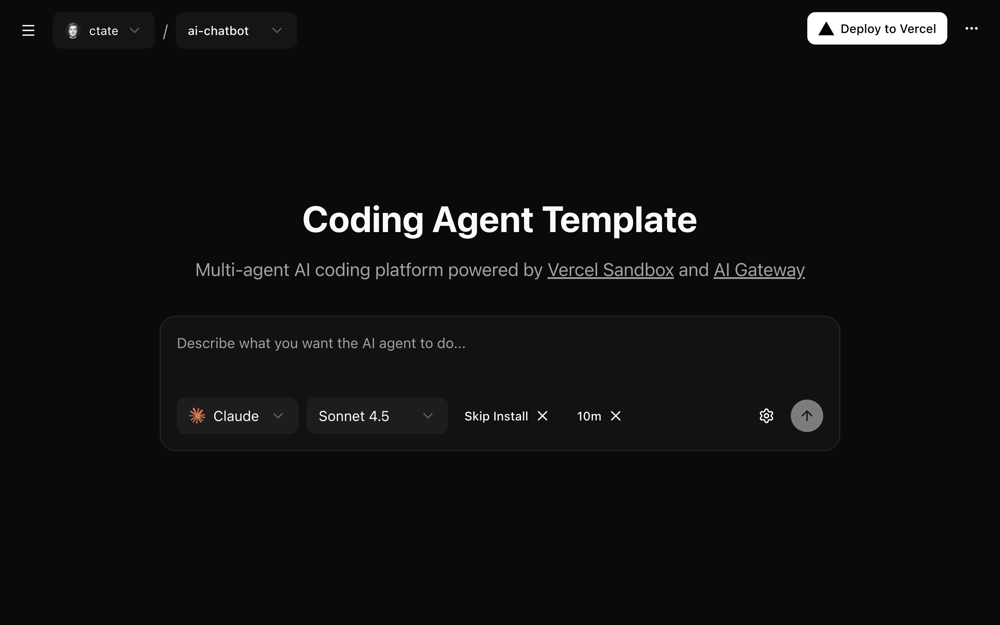

# Coding Agent Template

A template for building AI-powered coding agents that supports Claude Code, OpenAI's Codex CLI, GitHub Copilot CLI, Cursor CLI, Google Gemini CLI, and opencode with a Devbox runtime to automatically execute coding tasks on your repositories.



## Features

- **Multi-Agent Support**: Choose from Claude Code, OpenAI Codex CLI, GitHub Copilot CLI, Cursor CLI, Google Gemini CLI, or opencode to execute coding tasks
- **User Authentication**: Secure sign-in with GitHub OAuth
- **Multi-User Support**: Each user has their own tasks, API keys, and GitHub connection
- **Devbox Runtime**: Runs code in isolated, resumable runtimes
- **AI Gateway Integration**: Built for model routing and observability
- **AI-Generated Branch Names**: Automatically generates descriptive Git branch names using AI SDK 5 + AI Gateway
- **Task Management**: Track task progress with real-time updates
- **Persistent Storage**: Tasks stored in Neon Postgres database
- **Git Integration**: Automatically creates branches and commits changes
- **Modern UI**: Clean, responsive interface built with Next.js and Tailwind CSS
- **MCP Server Support**: Connect MCP servers to Claude Code for extended capabilities (Claude only)

## Quick Start

For detailed setup instructions, see the [Local Development Setup](#local-development-setup) section below.

**TL;DR:**
1. Clone the repository and install dependencies
2. Configure GitHub OAuth and required environment variables
3. Initialize the database and start creating tasks

Or run locally:
```bash
git clone <your-repository-url>
cd coding-agent-template
pnpm install
# Set up .env.local with required variables
pnpm db:push
pnpm dev
```

## Usage

1. **Sign In**: Authenticate with GitHub
2. **Create a Task**: Enter a repository URL and describe what you want the AI to do
3. **Monitor Progress**: Watch real-time logs as the agent works
4. **Review Results**: See the changes made and the branch created
5. **Manage Tasks**: View all your tasks in the sidebar with status updates

## Task Configuration

### Maximum Duration

The maximum duration setting controls how long the runtime sandbox will stay alive from the moment it's created. You can select timeouts ranging from 5 minutes to 5 hours.

- The sandbox is created at the start of the task
- The timeout begins when the sandbox is created
- All work (agent execution, dependency installation, etc.) happens within this timeframe
- When the timeout is reached, the sandbox automatically expires

### Keep Alive Setting

The Keep Alive setting determines what happens to the sandbox after your task completes.

#### Keep Alive OFF (Default)

When Keep Alive is disabled, the sandbox shuts down immediately after the task completes:

**Timeline:**
1. Task starts and sandbox is created (e.g., with 1 hour timeout)
2. Agent executes your task
3. Task completes successfully (e.g., after 10 minutes)
4. Changes are committed and pushed to the branch
5. Sandbox immediately shuts down (destroys all processes and the environment)
6. Task is marked as completed

**Use Keep Alive OFF when:**
- You're making one-time code changes that don't require iteration
- You have simple tasks that work on the first try
- You want to minimize resource usage and costs
- You don't need to test or manually interact with the code after completion

#### Keep Alive ON

When Keep Alive is enabled, the sandbox stays alive after task completion for the remaining duration:

**Timeline:**
1. Task starts and sandbox is created (e.g., with 1 hour timeout)
2. Agent executes your task
3. Task completes successfully (e.g., after 10 minutes)
4. Changes are committed and pushed to the branch
5. Sandbox stays alive with all processes running
6. You can send follow-up messages for 50 more minutes (until the 1 hour timeout expires)
7. If the project has a dev server (e.g., `npm run dev`), it automatically starts in the background
8. After the full timeout duration, the sandbox expires

**Use Keep Alive ON when:**
- You need to iterate on the code with follow-up messages
- You want to test changes in the live sandbox environment
- You anticipate needing to refine or fix issues
- You want to manually run commands or inspect the environment after completion
- You're developing a web application and want to see it running

#### Comparison

| Setting | Task completes in 10 min | Remaining sandbox time | Can send follow-ups? | Dev server starts? |
|---------|-------------------------|------------------------|---------------------|-------------------|
| Keep Alive ON | Sandbox stays alive | 50 minutes (until timeout) | Yes | Yes (if available) |
| Keep Alive OFF | Sandbox shuts down | 0 minutes | No | No |

**Note:** The maximum duration timeout always takes precedence. If you set a 1-hour timeout, the sandbox will expire after 1 hour regardless of the Keep Alive setting. Keep Alive only determines whether the sandbox shuts down early (after task completion) or stays alive until the timeout.

## How It Works

1. **Task Creation**: When you submit a task, it's stored in the database
2. **AI Branch Name Generation**: AI SDK 5 + AI Gateway automatically generates a descriptive branch name based on your task (non-blocking using Next.js 15's `after()`)
3. **Sandbox Setup**: A Devbox runtime is created with your repository
4. **Agent Execution**: Your chosen coding agent (Claude Code, Codex CLI, GitHub Copilot CLI, Cursor CLI, Gemini CLI, or opencode) analyzes your prompt and makes changes
5. **Git Operations**: Changes are committed and pushed to the AI-generated branch
6. **Cleanup**: The sandbox is shut down to free resources

## AI Branch Name Generation

The system automatically generates descriptive Git branch names using AI SDK 5 and AI Gateway. This feature:

- **Non-blocking**: Uses Next.js 15's `after()` function to generate names without delaying task creation
- **Descriptive**: Creates meaningful branch names like `feature/user-authentication-A1b2C3` or `fix/memory-leak-parser-X9y8Z7`
- **Conflict-free**: Adds a 6-character alphanumeric hash to prevent naming conflicts
- **Fallback**: Gracefully falls back to timestamp-based names if AI generation fails
- **Context-aware**: Uses task description, repository name, and agent context for better names

### Branch Name Examples

- `feature/add-user-auth-K3mP9n` (for "Add user authentication with JWT")
- `fix/resolve-memory-leak-B7xQ2w` (for "Fix memory leak in image processing")
- `chore/update-deps-M4nR8s` (for "Update all project dependencies")
- `docs/api-endpoints-F9tL5v` (for "Document REST API endpoints")

## Tech Stack

- **Frontend**: Next.js 15, React 19, Tailwind CSS
- **UI Components**: shadcn/ui
- **Database**: PostgreSQL with Drizzle ORM
- **AI SDK**: AI SDK 5
- **AI Agents**: Claude Code, OpenAI Codex CLI, GitHub Copilot CLI, Cursor CLI, Google Gemini CLI, opencode
- **Runtime**: Devbox-based execution environment
- **Authentication**: OAuth with GitHub
- **Git**: Automated branching and commits with AI-generated branch names

## MCP Server Support

Connect MCP Servers to extend Claude Code with additional tools and integrations. **Currently only works with Claude Code agent.**

### How to Add MCP Servers

1. Go to the "Connectors" tab and click "Add MCP Server"
2. Enter server details (name, base URL, optional OAuth credentials)
3. If using OAuth, ensure `ENCRYPTION_KEY` is set in your environment variables

**Note**: `ENCRYPTION_KEY` is required when using MCP servers with OAuth authentication.

## Local Development Setup

### 1. Clone the repository

```bash
git clone <your-repository-url>
cd coding-agent-template
```

### 2. Install dependencies

```bash
pnpm install
```

### 3. Set up environment variables

Create a `.env.local` file with your values:

#### Required Environment Variables (App Infrastructure)

These are set once by you (the app developer) and are used for core infrastructure:

- `POSTGRES_URL`: Your PostgreSQL connection string
- `DEVBOX_TOKEN`: Token used to provision and access the Devbox runtime API
- `SEALOS_HOST`: Sealos host entrypoint, for example `staging-usw-1.sealos.io`
- `JWE_SECRET`: Base64-encoded secret for session encryption (generate with: `openssl rand -base64 32`)
- `ENCRYPTION_KEY`: 32-byte hex string for encrypting user API keys and tokens (generate with: `openssl rand -hex 32`)

The app derives the rest from `SEALOS_HOST`:

- `region`: `staging-usw-1`
- `region_url`: `https://staging-usw-1.sealos.io`
- `template_api`: `https://template.staging-usw-1.sealos.io/api/v2alpha/templates/raw`
- `devbox_base_url`: `https://devbox-server.staging-usw-1.sealos.io`

#### User Authentication (Required)

Configure GitHub OAuth for user authentication:

```bash
NEXT_PUBLIC_AUTH_PROVIDERS=github
```

Required GitHub OAuth variables:
- `GITHUB_CLIENT_ID`: Your GitHub OAuth app client ID
- `GITHUB_CLIENT_SECRET`: Your GitHub OAuth app client secret
- `APP_BASE_URL`: Optional explicit public app URL for OAuth callbacks in self-hosted deployments

#### API Keys (Optional - Can be per-user)

These API keys can be set globally (fallback for all users) or left unset to require users to provide their own:

- `ANTHROPIC_API_KEY`: Anthropic API key for Claude agent (users can override in their profile)
- `AI_GATEWAY_API_KEY`: AI Gateway API key for branch name generation and Codex (users can override)
- `CURSOR_API_KEY`: For Cursor agent support (users can override)
- `GEMINI_API_KEY`: For Google Gemini agent support (users can override)
- `OPENAI_API_KEY`: For Codex and OpenCode agents (users can override)

> **Note**: Users can provide their own API keys in their profile settings, which take precedence over global environment variables.

#### GitHub Repository Access

- ~~`GITHUB_TOKEN`~~: **No longer needed!** Users authenticate with their own GitHub accounts.
  - Users who sign in with GitHub automatically get repository access via their OAuth token

**How Authentication Works:**
- **Sign in with GitHub**: Users get immediate repository access via their GitHub OAuth token

#### Optional Environment Variables

- `NPM_TOKEN`: For private npm packages
- `MAX_SANDBOX_DURATION`: Default maximum sandbox duration in minutes (default: `300` = 5 hours)
- `MAX_MESSAGES_PER_DAY`: Maximum number of tasks + follow-ups per user per day (default: `5`)

### 4. Set up OAuth Applications

Based on your `NEXT_PUBLIC_AUTH_PROVIDERS` configuration, you'll need to create OAuth apps:

#### GitHub OAuth App (if using GitHub authentication)

1. Go to [GitHub Developer Settings](https://github.com/settings/developers)
2. Click "New OAuth App"
3. Fill in the details:
   - **Application name**: Your app name (e.g., "My Coding Agent")
   - **Homepage URL**: `http://localhost:3000` (or your production URL)
   - **Authorization callback URL**: `http://localhost:3000/api/auth/github/callback`
4. Click "Register application"
5. Copy the **Client ID** → use for `GITHUB_CLIENT_ID`
6. Click "Generate a new client secret" → copy and use for `GITHUB_CLIENT_SECRET`

**Required Scopes**: The app will request `repo`, `read:user`, `user:email`, `read:packages`, and `write:packages` scopes to access repositories and push container images to GHCR.

> **Production Deployment**: Remember to add production callback URLs when deploying (e.g., `https://yourdomain.com/api/auth/github/callback`)

### 5. Set up the database

Generate and run database migrations:

```bash
pnpm db:generate
pnpm db:push
```

### 6. Start the development server

```bash
pnpm dev
```

Open [http://localhost:3000](http://localhost:3000) in your browser.

## Development

### Database Operations

```bash
# Generate migrations
pnpm db:generate

# Push schema changes
pnpm db:push

# Open Drizzle Studio
pnpm db:studio
```

### Running the App

```bash
# Development
pnpm dev

# Build for production
pnpm build

# Start production server
pnpm start
```

## Contributing

1. Fork the repository
2. Create a feature branch
3. Make your changes
4. Test thoroughly
5. Submit a pull request

## Security Considerations

- **Environment Variables**: Never commit `.env` files to version control. All sensitive data should be stored in environment variables.
- **API Keys**: Rotate your API keys regularly and use the principle of least privilege.
- **Database Access**: Ensure your PostgreSQL database is properly secured with strong credentials.
- **Devbox Runtime**: Runtimes are isolated but ensure you're not exposing sensitive data in logs or outputs.
- **User Authentication**: Each user uses their own GitHub token for repository access - no shared credentials
- **Encryption**: All sensitive data (tokens, API keys) is encrypted at rest using per-user encryption
