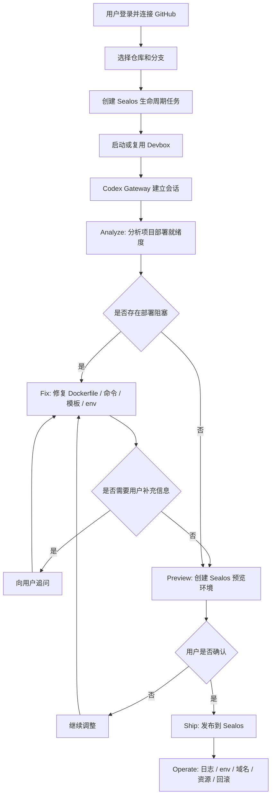

# ShipRepo 产品说明

## 1. 产品概述

ShipRepo 是一个以 GitHub 仓库为入口的 Sealos 应用生命周期工作台。用户选择自己的仓库后，系统通过 Devbox 中的 Codex 自动分析项目、修复部署阻塞、创建云端预览环境，并在用户确认后把应用发布到 Sealos。

它的目标不是做一个通用 AI Coding 控制台，也不是替代本地 IDE。它要解决的是一个更具体的问题：

> 用户已经有一个 GitHub repo，但不知道如何把它稳定变成一个可预览、可上线、可维护的 Sealos 应用。

因此产品主线不是“写代码”，而是：

```text
GitHub repo -> Analyze -> Fix -> Preview -> Ship -> Operate
```

## 2. 一句话定位

ShipRepo 把 GitHub 仓库转成可分析、可修复、可预览、可上线和可运维的 Sealos 应用。

## 3. 为什么不是只有一个部署按钮

“选择仓库并部署”只能解决最后一步，但用户真正卡住的通常在部署之前：

- 这个项目是什么技术栈？
- 应该用什么包管理器、构建命令和启动命令？
- 运行端口是什么？
- 是否缺少 Dockerfile？
- 是否缺少 Sealos 模板或部署参数？
- 需要哪些环境变量？
- 是否依赖数据库、Redis、对象存储或外部服务？
- 构建失败后应该怎么修？
- 预览通过后怎么转成长期运行的应用？
- 上线后如何看日志、改配置、重部署和回滚？

如果产品只做单点部署，失败时用户会看到一个黑盒错误。完整产品应该把失败前后的路径都接住，让系统能自动分析、自动修复，并把结果放到一个可验证的 Sealos 云端预览环境里。

## 4. 本地预览与 Sealos 预览的边界

本地 `localhost:3000` 适合开发者写代码时快速看页面，但它不能证明应用已经具备云端部署能力。

ShipRepo 的预览环境解决的是另一类问题：

- AI 在云端 Devbox 中修改或生成的部署文件，用户本地不会自动获得。
- 本地环境不可控，Node 版本、系统依赖、环境变量和端口状态都可能不同。
- 本地能跑不代表 Docker 构建、Sealos 网络、服务端口、数据库连接和对象存储都可用。
- Sealos 预览 URL 可以分享、复现和验收。
- 预览环境更接近正式部署形态，可以作为上线前确认点。

因此产品不需要证明自己比本地开发更快，而是要证明：

> 这个仓库已经能在 Sealos 的云端运行环境里工作。

## 5. 核心用户路径

### 5.1 Repo 接入

用户登录后连接 GitHub，选择一个仓库和分支。

系统应完成：

- 校验 GitHub 权限。
- 获取仓库基础信息。
- 记录仓库与任务的关系。
- 为后续 Devbox workspace 准备 clone 信息。

### 5.2 Analyze

Codex 在 Devbox 中检查仓库，输出部署就绪度。

分析内容包括：

- 技术栈和框架。
- 包管理器。
- 构建命令。
- 启动命令。
- 服务端口。
- Dockerfile 是否存在。
- Sealos 模板或部署配置是否存在。
- 必需环境变量。
- 数据库、对象存储、Redis 等资源需求。
- 构建和运行风险。

结果应尽量结构化，至少能区分：

- 可直接预览。
- 需要自动修复。
- 需要用户补充信息。
- 当前无法部署。

### 5.3 Fix

如果发现部署阻塞，Codex 只围绕部署目标进行修复，而不是无限制地做通用代码开发。

典型修复包括：

- 生成或修正 Dockerfile。
- 生成或修正 Sealos 部署模板。
- 修正 build/start 命令。
- 补充健康检查。
- 推断并列出环境变量。
- 调整服务监听地址和端口。
- 生成变更 diff 或 PR。

Fix 的原则是：最小改动，让项目具备 Sealos 可运行能力。

### 5.4 Preview

修复后系统创建 Sealos 云端预览环境。

预览环境应提供：

- 访问 URL。
- 构建状态。
- 运行状态。
- 关键日志。
- 当前使用的环境变量清单。
- 失败原因和下一步建议。

Preview 是产品的核心验收物。用户不需要先在本地拉代码、安装依赖、配置环境再测试，只需要打开预览 URL 验证结果。

### 5.5 Ship

用户确认预览可用后，将预览结果转成正式 Sealos 部署。

Ship 阶段应覆盖：

- 应用名称。
- 镜像或构建产物。
- 环境变量。
- 资源规格。
- 域名。
- 数据库或对象存储绑定。
- 部署状态。

### 5.6 Operate

上线不是结束。完整产品应继续承接运维动作。

后续能力包括：

- 查看日志。
- 解释错误。
- 修改环境变量并重启。
- 重新部署。
- 回滚。
- 绑定域名。
- 连接数据库、Redis、对象存储。
- 生成部署文档。
- 创建或更新 GitHub PR。

Operate 是产品从“工具”变成“工作台”的关键。

## 6. 核心价值

### 6.1 对开发者

- 不需要提前理解完整 Sealos 部署细节。
- 不需要手动准备 AI 模型 API Key。
- 不需要本地安装 Codex 或配置云端执行环境。
- 不需要先手写 Dockerfile 和部署模板。
- 可以用预览 URL 验收仓库是否真的能在 Sealos 上运行。

### 6.2 对 Sealos 平台

- 把 GitHub、AIProxy、Devbox、模板、数据库、对象存储和部署能力连接成完整链路。
- 降低用户从“有一个 GitHub 项目”到“应用跑在 Sealos 上”的门槛。
- 让 Devbox 成为 AI Agent 的云端执行环境。
- 让 AIProxy 成为平台内 AI 能力的默认入口。
- 把 Sealos 周边生态能力自然嵌入应用生命周期。

### 6.3 对部署流程

- 用户意图由 Codex 理解，而不是由用户填写大量表单。
- 项目结构由 Codex 自动分析，而不是要求用户提前选择框架和部署参数。
- 部署失败可以回到同一个任务中继续修复，而不是丢给用户一段日志。
- 预览环境成为正式上线前的稳定验收点。

## 7. 系统工作流



## 8. 关键模块

### 8.1 认证模块

认证模块负责识别当前用户，并为后续 GitHub 仓库访问、AIProxy、Devbox 和 Sealos 操作提供身份基础。

### 8.2 GitHub 仓库模块

GitHub 仓库模块负责让用户选择代码来源。

主要能力包括：

- 获取用户可访问的 GitHub 仓库。
- 将仓库信息绑定到任务。
- 在 Devbox 中准备对应仓库工作区。
- 为 Codex 提供仓库上下文。

### 8.3 AIProxy 接入模块

AIProxy 接入模块负责自动为用户准备模型调用能力。它的目标是让 Codex 能够开箱即用，而不是让用户先去找 API Key。

主要能力包括：

- 根据用户身份或 kubeconfig 调用 AIProxy 管理接口。
- 查询是否已有可用 token。
- 自动创建缺失的 token。
- 保存 API Key 和 Base URL。
- 在 Codex 运行时优先使用用户级 AIProxy 配置。

### 8.4 Devbox Runtime 模块

Devbox Runtime 模块负责提供任务执行环境。它连接了用户的生命周期任务和真实的云端运行时。

主要能力包括：

- 创建 Devbox。
- 复用已有 Devbox。
- 检查 Runtime 是否就绪。
- 准备仓库工作区。
- 注入 Codex 和 AIProxy 配置。
- 暴露 Codex Gateway 的访问入口。

### 8.5 Codex 会话模块

Codex 会话模块负责让用户和 Devbox 内的 Codex 建立持续对话。

主要能力包括：

- 创建 Codex session。
- 发送用户消息。
- 接收 Codex 事件流。
- 持久化对话消息和任务状态。
- 支持用户在同一个任务中继续追问、修复和重新执行。

### 8.6 Sealos 应用生命周期模块

Sealos 应用生命周期模块负责把 Codex 的分析和修复结果转成 Sealos 上的真实应用状态。

主要能力包括：

- 生成部署模板或部署请求。
- 创建预览环境。
- 提交正式部署。
- 获取部署状态。
- 返回应用访问地址、镜像地址和日志。
- 承接后续日志、环境变量、域名、资源绑定和回滚操作。

## 9. 产品边界

第一阶段应优先保证：

- 用户可以选择 GitHub 仓库。
- 系统可以分析仓库部署就绪度。
- 系统可以在部署阻塞明确时自动修复。
- Devbox 可以稳定启动并承载 Codex。
- Codex 可以生成或修正部署所需文件。
- 用户可以得到 Sealos 预览 URL 或明确失败原因。
- 预览通过后可以进入正式发布路径。

以下能力不应作为第一阶段核心：

- 完整在线 IDE。
- 通用 AI Coding。
- 非 Sealos 目标平台部署。
- 复杂 CI/CD 编排。
- 大量与部署无关的代码编辑能力。

## 10. 安全与凭证原则

产品链路会涉及 kubeconfig、AIProxy API Key、GitHub Token、Devbox Token 等敏感信息，因此需要遵守以下原则：

- 敏感凭证只在服务端处理和加密保存。
- 前端不直接展示 API Key、Token 或 kubeconfig。
- 日志中不输出动态凭证、仓库地址、文件路径或用户隐私信息。
- 用户级 AIProxy token 应按用户隔离，不与其他用户共享。
- Devbox 运行环境应与任务和用户绑定，避免跨用户复用工作区。
- Codex 的模型调用默认通过平台受控的 AIProxy 入口完成。

## 11. 推荐对外描述

ShipRepo 是一个面向 GitHub 项目的 AI 部署工作台。用户选择仓库后，系统会自动分析项目、修复部署阻塞、创建 Sealos 云端预览环境，并在用户确认后发布为正式应用。它让开发者不用先理解 Dockerfile、部署模板、环境变量和云端资源配置，就能把已有仓库推进到可预览、可上线、可运维的 Sealos 应用。

## 12. 推荐内部描述

从内部实现看，ShipRepo 是一条围绕 GitHub 仓库展开的任务编排链路：

1. 用户登录并连接 GitHub。
2. 用户选择仓库并创建生命周期任务。
3. 系统准备 AIProxy 模型调用配置。
4. 系统启动 Devbox，并在 Devbox 中运行 Codex Gateway。
5. Codex 分析仓库部署就绪度。
6. Codex 修复部署阻塞或向用户追问缺失信息。
7. 系统创建 Sealos 预览环境。
8. 用户确认后发布到 Sealos。
9. Web 应用持久化任务状态，并承接后续运维动作。

这条链路的核心设计思想是：代码入口在 GitHub，执行环境在 Devbox，智能分析由 Codex 完成，模型能力走 AIProxy，最终产物进入 Sealos 应用生命周期。
